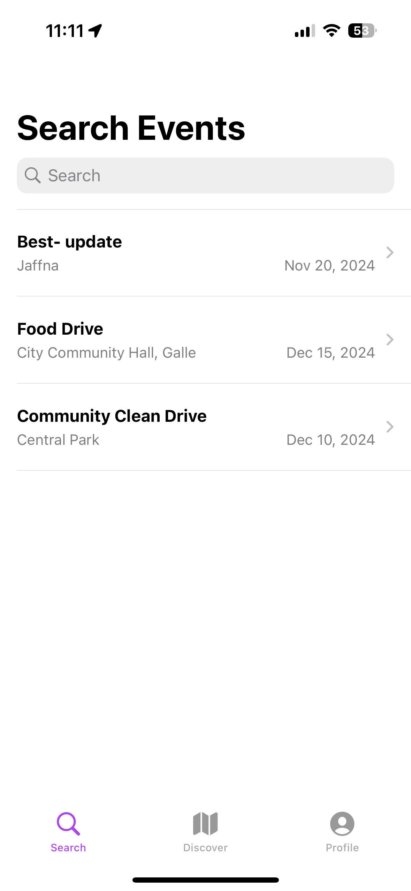

# Project Name - Voluntr
# Student Id - IT21127496
# Student Name - Jayawardana D.N.

#### 01. Brief Description of Project - 
"Voluntr" is a mobile app designed to connect people with volunteer opportunities in one convenient platform. It allows users to explore a wide variety of volunteering options, such as beach clean-ups, disaster relief, animal shelter support, food distributions, and more. The app serves two main user groups: organizers and volunteers. Organizers can use the app to create and share details about their events, including schedules, locations, and relevant information. Volunteers, on the other hand, can search for opportunities that match their availability, skills, and interests, and easily confirm their participation directly through the app.
#### 02. Users of the System - 
Individuals who are interested in volunteering and organizations that are looking for volunteers.
#### 03. What is unique about your solution -

- Map integration to show the location of the volunteering events.
- The application provides a centralized platform for both organizers and volunteers to connect.
- The application allows organizers to post volunteering events by providing a schedule, location, and other details.

#### 04. Briefly document the functionality of the screens you have (Include screen shots of images)


### 1. **Login Screen**  
   This is where users sign in to their account or create a new one. It uses Firebase Authentication to manage users securely.

   

### 2. **Registration Screen**  
   Users can create a new account by entering their details like name, email, and password.

   

### 3. **Home Screen (Map Discovery)**  
   The home screen features a map view where users can discover volunteer events near them based on their location.

   

### 4. **Event Search Screen**  
   Users can search for volunteer events by name, category, or date. This screen also allows filtering by location or event type.

   

### 5. **Event Details Screen**  
   Displays detailed information about a specific event, including location, time, requirements, and a registration option.

   

### 6. **Profile Screen**  
   Users can view and edit their profile details, including their contact information and volunteer preferences.

   

### 7. **My Events Screen**  
   Shows a list of events that the user has registered for, including their participation status.

   

### 8. **Create Event Screen**  
   Organizations or users can create a new volunteer event, providing details like event name, description, time, and location.

   

### 9. **Joined Events Screen**  
   Users can see a list of events they’ve joined, including any relevant updates or reminders.

   


#### 05. Give examples of best practices used when writing code
<!-- e.g The code below uses consistent naming conventions for variables, uses structures and constants where ever possible. (Elaborate a bit more on what you did) -->

The following code snippet demonstrates the use of best practices when writing code, such as consistent naming conventions, the use of structures, and constants where possible. The code snippet defines a Swift struct called Event that represents a volunteering event. The struct includes properties for the event's title, description, date, location, user ID, participants, duration, city, available slots, and image URL.

```swift
import Firebase
import FirebaseFirestore
import SwiftUI

struct Event: Identifiable, Decodable {
    @DocumentID var id: String?
    var title: String
    var description: String
    var date: Timestamp
    var location: GeoPoint
    var userId: String
    var participants: [String] // Array to store the user IDs of participants
    var duration: Int
    var city: String
    var availableSlots: Int
    var imageURL: String
    
    
    // Additional properties for managing event participation
    var isUserParticipant: Bool { 
        guard let currentUserID = Auth.auth().currentUser?.uid else {
            return false
        }
        return participants.contains(currentUserID)
    }
    
    // Additional methods for managing event participation
    mutating func addParticipant(userID: String) {
        participants.append(userID)
    }
    
    mutating func removeParticipant(userID: String) {
        participants.removeAll { $0 == userID }
    }
}
```

#### 06. UI Components used

The following components were used in the Voluntr App:
 - Button
 - Text Field
 - Label
 - Image View
 - Map View
 - Table View
 - Navigation Bar
 - Tab Bar
 - Stack View
 - Collection View
 - Alert Controller

#### 07. Testing carried out

<!-- e.g. The following classes implemented unit testing for the ```Landmark struct``` and ```Location struct```. 

```
    struct TestLandMarks {
       let name: String
``` -->
Both unit testing and UI testing were carried out for the Voluntr app. 

Unit Testing:
Following classes implemented unit testing which create event in firebase and delete it.
```swift
import XCTest
import Firebase

@testable import Voluntr

final class VoluntrTests: XCTestCase {
    func testEventService() throws {
        let event = Event(id: "1", title: "Test Event", description: "This is a test event", date: Timestamp(date: Date()), location: GeoPoint(latitude: 0, longitude: 0), userId: "1", participants: [], duration: 60, city: "Test City", availableSlots: 10, imageURL: "https://example.com/image.jpg")

        EventService.createEvent(event: event) { (error) in
            XCTAssertNil(error, "Error creating event")
        }

        EventService.fetchEvents { (events) in
            XCTAssertNotNil(events, "Events not fetched")
        }
        
        EventService.deleteEvent(event: event) { (error) in
            XCTAssertNil(error, "Error deleting event")
        }
        
    }
}
```

UI Testing:

Following code is UI testing the user flow of logging in, searching for an event, joining the event, and logging out.

```swift
import XCTest

final class VoluntrUITests: XCTestCase {
 func testJoinEvent() throws {
        let app = XCUIApplication()
        app.launch()
      
        let emailTextField = app.textFields["Email"]
        XCTAssertTrue(emailTextField.exists)
        emailTextField.tap()
        emailTextField.typeText("test@gmail.com")

        let passwordTextField = app.secureTextFields["Password"]
        XCTAssertTrue(passwordTextField.exists)
        passwordTextField.tap()
        passwordTextField.typeText("123123")

        app.buttons["Sign In"].tap()

        let tabBar = app.tabBars["Tab Bar"]
        let searchButton = tabBar.buttons["Search"]
        let profileButton = tabBar.buttons["Profile"]
        
        searchButton.tap()
        app.collectionViews.buttons["Beach Cleanup"].tap()
        app.buttons["Join"].tap()


        tabBar.buttons["Profile"].tap()
        app.buttons["Log out"].tap()  
    }
}
```

#### 08. Documentation 

(a) Design Choices

The Voluntr app is designed with simplicity and ease of use in mind, featuring a clean layout that makes navigation effortless. Key sections of the app, such as the home screen, event search, and user profiles, are easily accessible through a tab bar at the bottom of the screen. Within each section, users can seamlessly navigate using a straightforward navigation bar.

On the home screen, users are greeted with a map view that highlights nearby volunteering opportunities. Tapping on a pin reveals event details, including the name, date, time, and location. For those looking for specific events, the search function allows filtering by event name, date, or location. Search results provide quick access to event details with just a tap.

A "My Events" section helps users track the events they've signed up for, offering easy access to event information. Meanwhile, organizers can create new opportunities through the "Create Event" screen, where they can input essential details like the event name, schedule, location, and more. Every feature is designed to make finding, joining, and hosting volunteering events as intuitive as possible.
(b) Implementation Decisions
For the development of the Voluntr app, the following implementation decisions were made:
- Authentication: Firebase Authentication was used to authenticate users.


- Database: Firebase Firestore was used to store app data, such as user profiles and event details. Because this application needs to store and retrieve data from a backend for multiple users, Firestore was the best choice.


- Map Integration: MapKit framework was used to integrate the map view.


<!-- 
(c) Challenges -->

#### 09. Reflection
<!-- 
Challenges that you faced in doing the assignment (other than know technical issues of getting hold of a proper Mac machine).
How would have approached this Assignment differently -->

Main challenges faced during the development of the Voluntr app were related to the integration of the map view and the implementation of the event creation feature. The map view integration was challenging due to the complexity of the MapKit framework. The event creation feature was challenging due to the need to store event data in a cloud database and retrieve it when needed. If I were to approach this assignment differently, I would have spent more time on the design phase to ensure that all features are well thought out and planned before starting the implementation phase.

  

